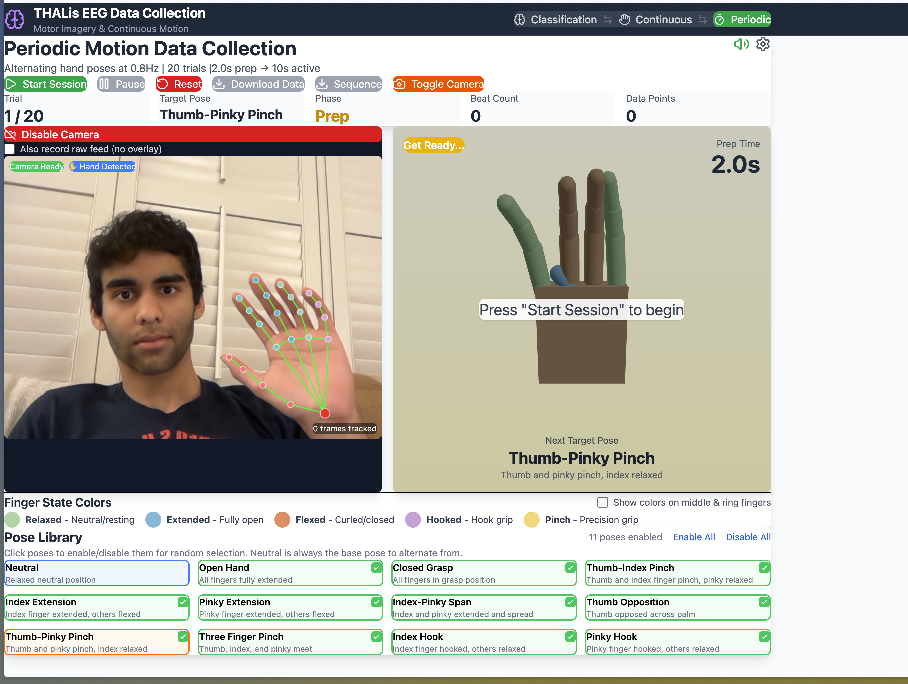

# THALis EEG Motor Imagery Collector

A comprehensive React web application designed to assist in the collection of EEG motor imagery and continuous motion data. The app provides visual cues, 3D hand visualization, and webcam-based hand tracking to guide subjects through various motor imagery and execution tasks.



## Features

The application offers three distinct data collection modes tailored for different types of EEG experiments:

### 1. Classification Mode

Designed for discrete finger classification tasks (e.g., rest, thumb, index, pinky).

- **Trial Structure**: 5s Rest → 1s Cue → 3s Motor Imagery.
- **Visual Guidance**: Clear on-screen instructions and progress bars.

### 2. Continuous Motion Mode

Designed for continuous hand pose tracking and kinematic parameter collection.

- **Trial Structure**: 2s Rest/Hold → 1.2s Smooth transition to a new target pose.
- **Virtual Hand**: Displays a 3D virtual hand with kinematic parameters for thumb, index, and pinky fingers.

### 3. Periodic Motion Mode

Designed for periodic alternation between neutral and target poses at a fixed frequency.

- **Trial Structure**: 2s Preparation → 10s Active phase (alternating at an adjustable frequency).
- **Metronome Guidance**: Audio metronome-guided movement with configurable frequency (default 0.8Hz).

### Additional Features

- **3D Hand Visualization**: Real-time 3D rendering of the Shadow Robot Hand E model using Three.js (`@react-three/fiber` and `@react-three/drei`).
- **Webcam Recording & Hand Tracking**: Integrated webcam recording with real-time hand landmark tracking using MediaPipe Hands.
- **Data Logging**: Exports synchronized hand landmark data, joint angles, and trial metadata to CSV for offline analysis.

## Tech Stack

- **Frontend Framework**: React 19, Vite
- **Styling**: Tailwind CSS, Lucide React (Icons)
- **3D Rendering**: Three.js, React Three Fiber, React Three Drei
- **Computer Vision**: MediaPipe Hands, MediaPipe Camera Utils

## Installation & Setup

1. **Clone the repository**

   ```bash
   git clone https://github.com/blizzard-labs/eeg-motor-imagery-collector.git
   cd eeg-motor-imagery-collector
   ```

2. **Install dependencies**

   ```bash
   npm install
   ```

3. **Start the development server**

   ```bash
   npm run dev
   ```

4. **Open the app**

   Navigate to `http://localhost:5173` in your web browser.

## Usage

1. Select the desired data collection mode from the top navigation bar (Classification, Continuous, or Periodic).
2. Configure any mode-specific settings (e.g., metronome frequency in Periodic mode).
3. Enable the camera if you wish to record webcam video and track hand landmarks.
4. Click the **Start Session** button to begin the data collection protocol.
5. Follow the on-screen visual and audio cues.
6. Once the session is complete, the recorded data (CSV logs and video) will be available for download.

## License

This project is licensed under the MIT License - see the [LICENSE](LICENSE) file for details.
